# ArchGeo Library 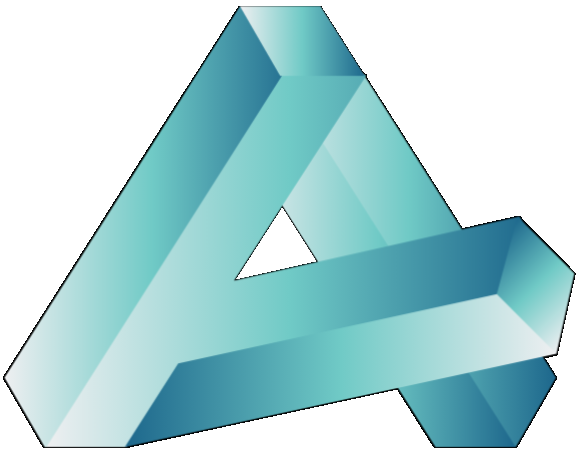

| Basic Library | Related Projects | **License** | **Documentation** |
|:-:|:-:|:-:|:-:|
| Numpy,SciPy,Mayavi,[geometrylab](https://github.com/WWmore/geometrylab) | [Discrete Orthogonal Structures ](https://github.com/WWmore/DOS#discrete-orthogonal-structures) | [](https://tlo.mit.edu/researchers-mit-community/protect/software-open-source-protection)|  [](https://www.huiwang.me/mkdocs-archgeo/) |

ArchGeo is a geometry processing library with integrated visualization and optimization capabilities, designed to support efficient design and construction by leveraging Discrete Differential Geometry (DDG).

Written in Python, it uses a half-edge data structure to handle various meshes. It also offers visualization and rendering of geometric objects such as point clouds and curves, alongside mesh optimization design. 
For visualization, it utilizes the Python-based [Mayavi3D library](https://mayavi.readthedocs.io/zh-cn/latest/index.html), and for optimization, it focuses on quadrilateral meshes using a Guided Projection algorithm and an efficient solver.

Comprehensive [documentation for ArchGeo](https://www.huiwang.me/mkdocs-archgeo/) is available, covering core aspects like installation and optimization algorithms. Welcome to check!
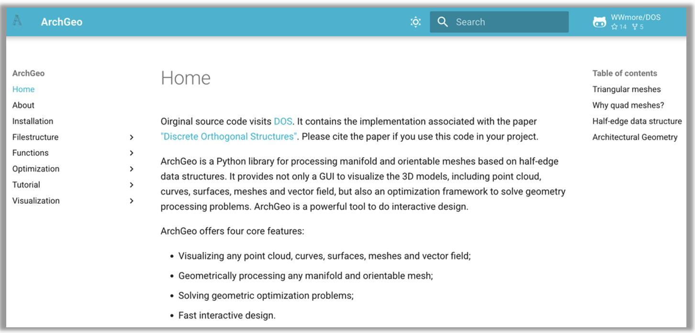

This GitHub repository, dedicated to the "Discrete Orthogonal Structures" project, showcases orthogonal quad mesh optimization within the Discrete Differential Geometry (DDG) research area. It highlights the capabilities of ArchGeo. More features will be open-sourced soon.


# Discrete Orthogonal Structures 

<!--  -->

Felix Dellinger, Xinye Li, and Hui Wang* (corresponding author)<br>
| [Project Page](https://www.huiwang.me/projects/10_project/) | [Full Paper](https://www.huiwang.me/assets/pdf/2023SMI.pdf) | [Publication Page](https://doi.org/10.1016/j.cag.2023.05.024) | [Documentation](https://www.huiwang.me/mkdocs-archgeo/) |<br>
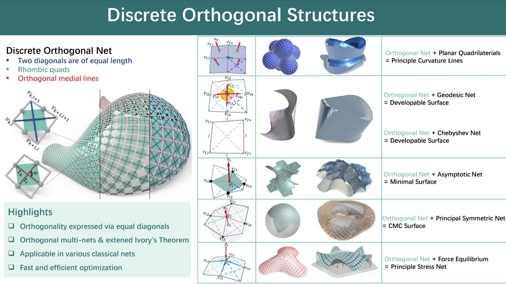

<details>
<summary><span style="font-weight: bold;">Abstract</span></summary>

  *To represent smooth geometric shapes by coarse polygonal meshes, visible edges often follow special families of curves on a surface to achieve visually pleasing results. Important examples of such families are principal curvature lines, asymptotic lines or geodesics. In a surprisingly big amount of use-cases, these curves form an orthogonal net. While the condition of orthogonality between smooth curves on a surface is straightforward, the discrete counterpart, namely orthogonal quad meshes, is not. In this paper, we study the definition of discrete orthogonality based on equal diagonal lengths in every quadrilateral. We embed this definition in the theory of discrete differential geometry and highlight its benefits for practical applications. We demonstrate the versatility of this approach by combining discrete orthogonality with other classical constraints known from discrete differential geometry. Orthogonal multi-nets, i.e. meshes where discrete orthogonality holds on any parameter rectangle, receive an in-depth analysis.*

</details>
<br>

This repository contains the implementation associated with the paper ["Discrete Orthogonal Structures"](https://doi.org/10.1016/j.cag.2023.05.024). 
Please cite the paper if you use this code in your project. 

<section class="section" id="BibTeX">
  <div class="container is-max-desktop content">
    <h2 class="title">BibTeX</h2>
    <pre><code>@Article{DOS2023,
      author       = {Dellinger, Felix and Li, Xinye and Wang, Hui},
      title        = {Discrete Orthogonal Structures},
      journal      = {Computers & Graphics},
      volume       = {114},
      pages        = {126--137},
      month        = {June},
      year         = {2023},
      doi          = {10.1016/j.cag.2023.05.024},
      url          = {https://www.huiwang.me/projects/10_project/}
}</code></pre>
  </div>
</section>


## Set up a working environment in Windows / MacOS

Using Anaconda to install every package.

    1. Download Anaconda

    2. Open Anaconda Prompt
    ```
    $ conda create -n geo 
    $ conda activate geo
    $ conda install mayavi traits traitsui qt pyqt vtk scipy spyder 
    $ conda install -c haasad pypardiso
    ```
    3. Open Anaconda, under "geo" environment open Spyder

Once above installation failed because of versions conflict, then try below installations:
<details>
<summary><span style="font-weight: bold;">step-by-step installation.</span></summary>

    ```
    $ conda create -n geo python=3.6
    $ conda activate geo
    $ pip install numpy scipy
    $ pip install python-vtk
    $ pip install mayavi --no-cache
    $ conda install -c haasad pypardiso
    $ conda install pyface
    ```

  Or use the exported files within ```./conda/``` to set your environment

    ```
    $ conda env create -f environment.yml
    ```

</details>
<br>


## File Relations

<details>
<summary><span style="font-weight: bold;">File tree.</span></summary>

  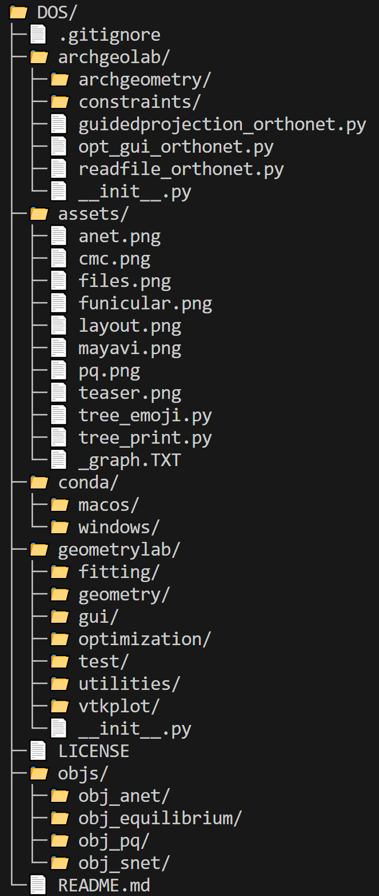

</details>
<br>

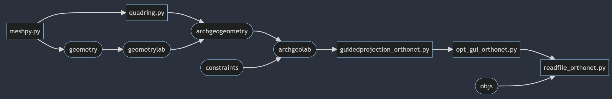

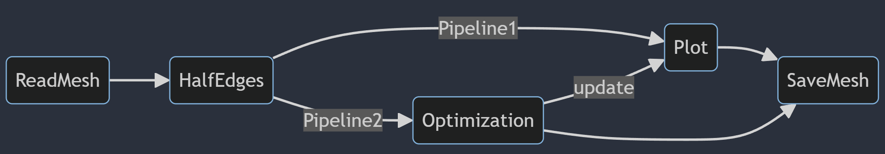

<details>
<summary><span style="font-weight: bold;">File notice.</span></summary>

  - files in geometrylab folder are basic, nothing need to be changed.

  - archgeolab/archgeometry: meshpy.py --> quadrings.py --> gridshell_new.py --> gui_basic.py --> guidedprojection_orthonet.py --> opt_gui_orthonet.py --> readfile_orthonet.py

  - run readfile_orthonet.py to test how it works; a GUI window will be opened
  
  - The GUI settings are in opt_gui_orthonet.py
  
  - The constraints settings are in guidedprojection_orthonet.py

  - if you want to add a new optimization project, please refer to archgeolab; You can create a new folder similar to the folder 'archgeolab'. Then the mesh geometry, optimization and GUI will be based on the files in geometrylab folder.

</details>
<br>


## Mesh Optimization
It utilizes the Guided Projection Algorithm, a Gauss-Newton algorithm, as discussed in the paper [Form-finding with polyhedral meshes made simple](https://doi.org/10.1145/2601097.2601213), to optimize and generate quadmesh models.

<details>
<summary><span style="font-weight: bold;">Abstract of the paper 'Form-finding with Polyhedral Meshes Made Simple'</span></summary>

  *We solve the form-finding problem for polyhedral meshes in a way which combines form, function and fabrication; taking care of user-specified constraints like boundary interpolation, planarity of faces, statics, panel size and shape, enclosed volume, and last, but not least, cost. Our main application is the interactive modeling of meshes for architectural and industrial design. Our approach can be described as guided exploration of the constraint space whose algebraic structure is simplified by introducing auxiliary variables and ensuring that constraints are at most quadratic. Computationally, we perform a projection onto the constraint space which is biased towards low values of an energy which expresses desirable "soft" properties like fairness. We have created a tool which elegantly handles difficult tasks, such as taking boundary-alignment of polyhedral meshes into account, planarization, fairing under planarity side conditions, handling hybrid meshes, and extending the treatment of static equilibrium to shapes which possess overhanging parts.*

</details>
<br>

## ArchGeo Visualization

This implementation primarily addresses optimization problems involving quad meshes, offering a robust tool for researchers and practitioners in Geometry Processing and Architectural Geometry. It is designed to streamline the exploration and resolution of intricate geometric optimization tasks, enhancing the visualization and comprehension of the underlying processes and results.


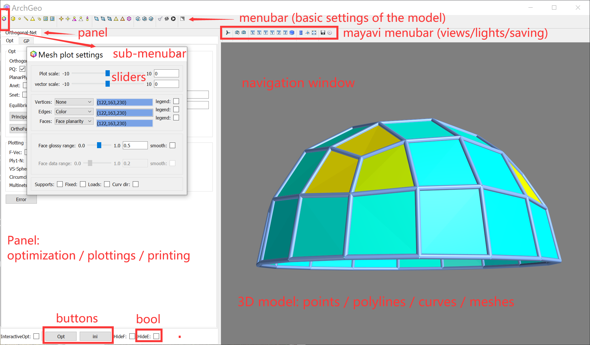


### Implementation layout
[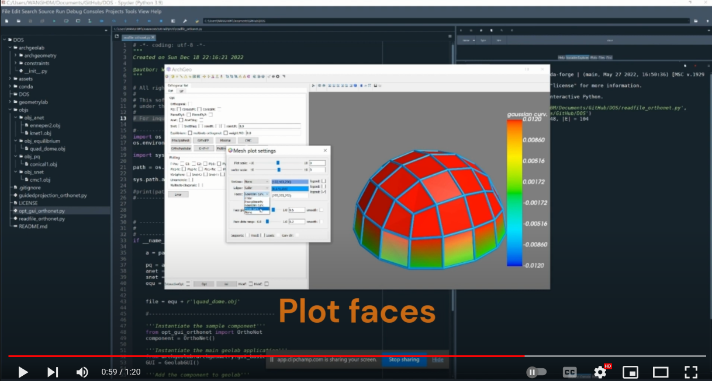](https://www.youtube.com/embed/1l6DCW9BmYM)


### Implementation of a principal net optimized from an orthogonal PQ mesh
[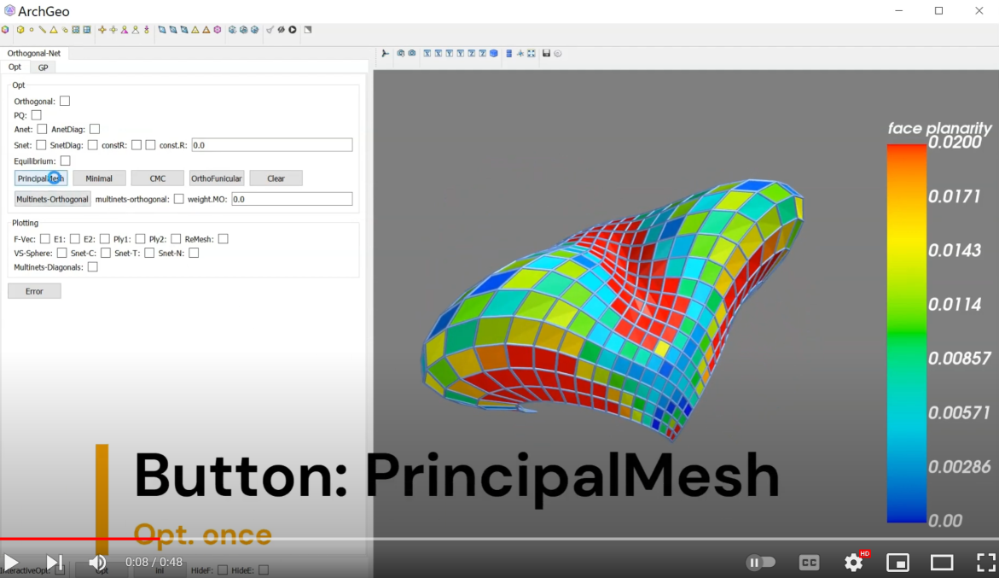](https://www.youtube.com/embed/m-CFC0XZ488)


### Implementation of a minimal net optimized from an orthogonal A-net
[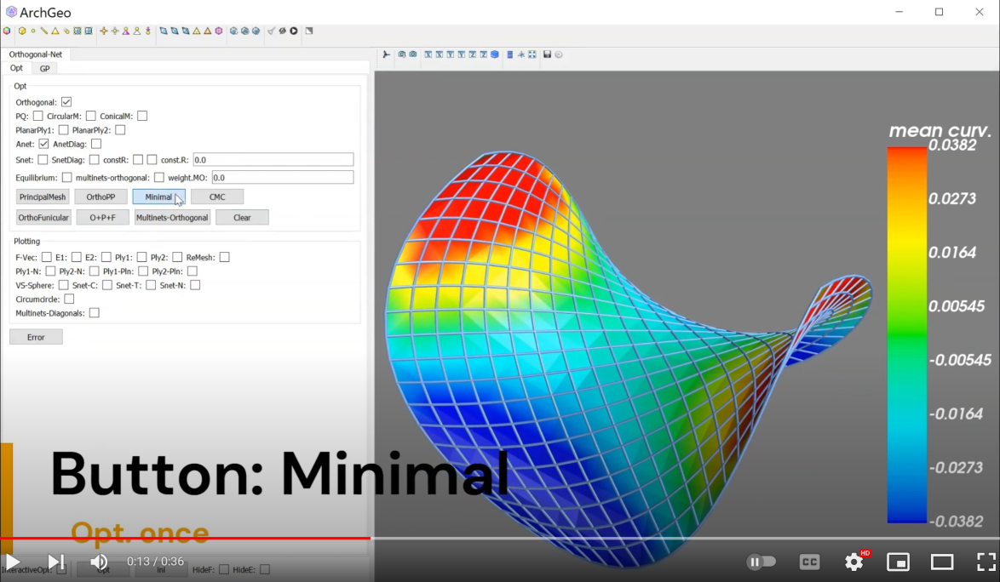](https://www.youtube.com/embed/KQbJ2e_Ow7M)


### Implementation of a CMC net optimized from an orthogonal S-net with const. radius
[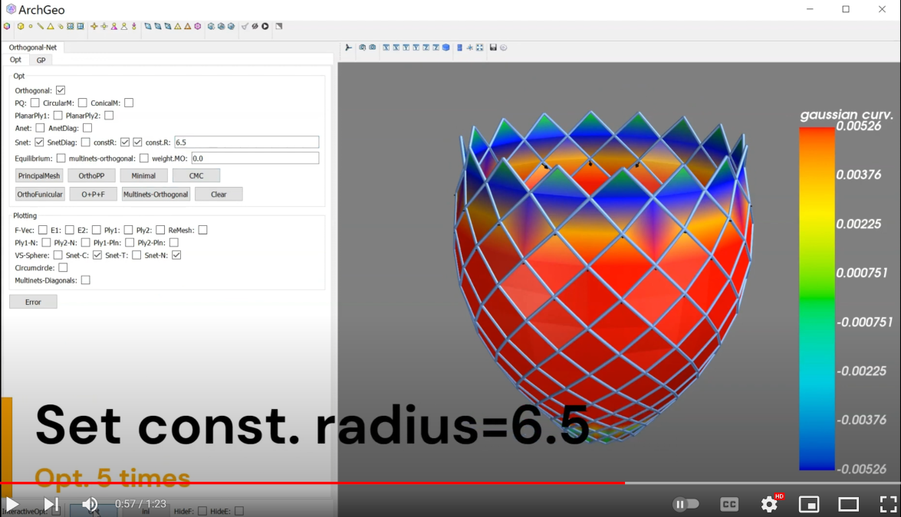](https://www.youtube.com/embed/vgb9A6uAidw)


### Implementation of a principal stress net from an orthogonal equilibrium mesh
[](https://www.youtube.com/embed/sOzjRHIrR-s)


------
## Contributions

<!-- ### Project Background and Evolution -->
ArchGeo, initially developed by [Davide Pellis](https://scholar.google.com/citations?user=JnocFM4AAAAJ&hl=en), originated from TU Wien's research in architectural geometry and has since evolved through projects at KAUST and Xi'an Jiaotong University. This journey has resulted in around 20 top-tier academic publications.

<!-- ### Core Algorithms and Applications -->
Its core algorithms can be integrated with Rhino3D's Grasshopper plugin, significantly aiding in the design of [large-scale grid shells](https://github.com/WWmore/compute.rhino3d). This integration exemplifies ArchGeo's pivotal role in advancing geometric design and construction.

<!-- ### Features and User Benefits -->
ArchGeo is a user-friendly, Python-based geometry processing tool with an intuitive GUI for efficient geometric design. It serves as an excellent entry point for research in DDG, CAD, and CG.
Looking ahead, ArchGeo aims to expand its industrial software applications, particularly in education and research. It also seeks to deepen its integration with industrial tools like Rhino3D and support geometric optimization across various sectors.

<!-- ### Call for Collaboration -->
If you find our codebase and paper valuable for your research, we encourage you to cite the paper and star :star: our GitHub repository. ArchGeo is continuously being developed, and we welcome any issues or contribution requests. 
We also invite collaboration on developing a Grasshopper plugin. 
For commercial use, kindly contact us. 

We hope this codebase proves useful for your research endeavors.