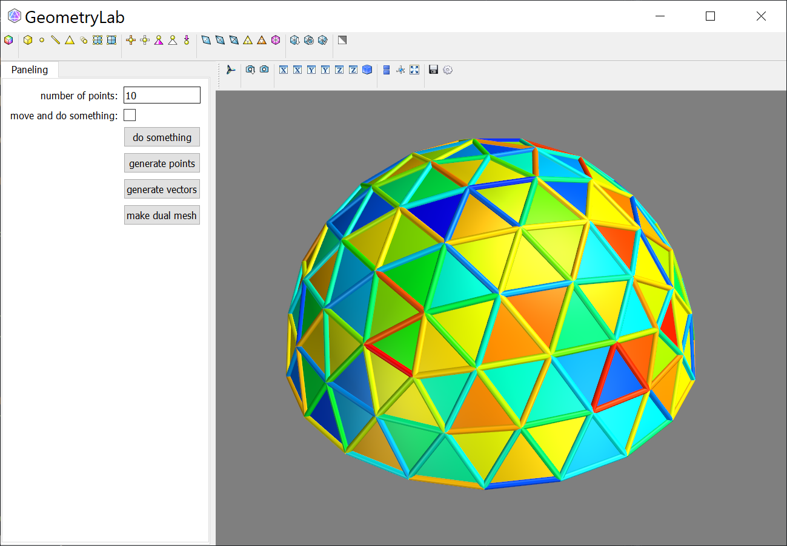

# geometrylab
python + mayavi codebase for visualizing optimization problem in Geometry Processing / Archtectural Geometry


| Basic Library | **License** | **Documentation** | Generalized Optimization Code |
|:-:|:-:|:-:|:-:|
| Numpy,SciPy,Mayavi | [](https://tlo.mit.edu/researchers-mit-community/protect/software-open-source-protection)|   [](https://www.huiwang.me/mkdocs-archgeo/) | [ArchGeo](https://github.com/WWmore/DOS)  |


This library was initially developed by [Davide Pellis](https://scholar.google.com/citations?user=JnocFM4AAAAJ&hl=en).
A generalized use of it has been developed in the [ArchGeo library](https://github.com/WWmore/DOS).
Please refer the [Documentation](https://www.huiwang.me/mkdocs-archgeo/) for more detail explanation.


## Set up a working environment in Windows / MacOS

Using Anaconda to install every package.

    1. Download Anaconda

    2. Open Anaconda Prompt
    ```
    $ conda create -n geo 
    $ conda activate geo
    $ conda install mayavi traits traitsui qt pyqt vtk scipy spyder 
    $ conda install -c haasad pypardiso
    ```
    3. Open Anaconda, under "geo" environment open Spyder

Once above installation failed because of versions conflict, then try below installations:

    ```
    $ conda create -n geo python=3.6
    $ conda activate geo
    $ pip install numpy scipy
    $ pip install python-vtk
    $ pip install mayavi --no-cache
    $ conda install -c haasad pypardiso
    $ conda install pyface
    ```

## File tree

<details>
<summary><span style="font-weight: bold;">File tree.</span></summary>

  
</details>
<br>


## Mesh Optimization
The optimizer uses Guided Projection Algorithm, a Gauss-Newton algorithm, as dissused in the paper [Form-finding with polyhedral meshes made simple](https://doi.org/10.1145/2601097.2601213), in a Python environment to produce quadmesh models.

<details>
<summary><span style="font-weight: bold;">Abstract of the paper 'Form-finding with Polyhedral Meshes Made Simple'</span></summary>

  We solve the form-finding problem for polyhedral meshes in a way which combines form, function and fabrication; taking care of user-specified constraints like boundary interpolation, planarity of faces, statics, panel size and shape, enclosed volume, and last, but not least, cost. Our main application is the interactive modeling of meshes for architectural and industrial design. Our approach can be described as guided exploration of the constraint space whose algebraic structure is simplified by introducing auxiliary variables and ensuring that constraints are at most quadratic. Computationally, we perform a projection onto the constraint space which is biased towards low values of an energy which expresses desirable "soft" properties like fairness. We have created a tool which elegantly handles difficult tasks, such as taking boundary-alignment of polyhedral meshes into account, planarization, fairing under planarity side conditions, handling hybrid meshes, and extending the treatment of static equilibrium to shapes which possess overhanging parts.

</details>
<br>


## Open the GUI 

If you want to test how it works, just try python files in geometrylab/test: ex. run paneling.py, then a GUI window will be opened.
You can add waterever you like for the settings of optimization and visualization.



More implementation architecture can refer to the [DOS project](https://github.com/WWmore/DOS), which is based on this codebase.

